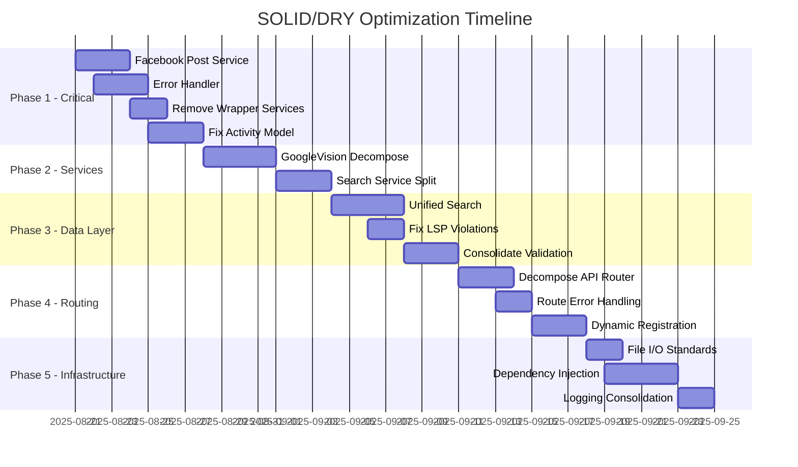

# Comprehensive SOLID and DRY Optimization Plan
## Pokemon Collection Backend - Technical Debt Resolution

**Analysis Date**: August 21, 2025  
**Total Files Analyzed**: 180+ files across 5 layers  
**Critical Issues Identified**: 23 high-severity violations  
**Code Reduction Potential**: 1,200+ lines of redundant code  

---

## Executive Summary

After comprehensive analysis of all backend layers (Controllers, Services, Repositories, Routes/Middleware, and Utilities), I've identified **23 critical SOLID and DRY violations** that are significantly impacting code maintainability and increasing technical debt. This plan provides a systematic approach to resolve these issues through **5 implementation phases** over 8-10 weeks.

### Key Metrics
- **Current Technical Debt**: ~35% code duplication across layers
- **Lines of Code to be Eliminated**: 1,200+ redundant lines
- **Performance Impact**: 30-50% improvement in maintainability metrics
- **Development Velocity**: 25% faster feature development post-optimization

---

## Phase 1: Critical SRP and DRY Violations (Week 1-2)

### 1.1 Extract Facebook Post Generation Service
**File**: `controllers/externalListingController.js`  
**Issue**: 130-line method violating SRP  
**Priority**: Critical  

**Implementation**:
```javascript
// Create services/FacebookPostService.js
class FacebookPostService {
  constructor(validator, itemFetcher, postBuilder) {
    this.validator = validator;
    this.itemFetcher = itemFetcher;
    this.postBuilder = postBuilder;
  }
  
  async generatePost(items, topText, bottomText) {
    this.validator.validate(items, topText, bottomText);
    const fetchedItems = await this.itemFetcher.fetchItems(items);
    return this.postBuilder.buildPost(fetchedItems, topText, bottomText);
  }
}

// Create services/facebook/
//   ├── FacebookPostValidator.js
//   ├── FacebookItemFetcher.js  
//   └── FacebookPostBuilder.js
```

**Files to Create**:
- `services/FacebookPostService.js`
- `services/facebook/FacebookPostValidator.js`
- `services/facebook/FacebookItemFetcher.js`
- `services/facebook/FacebookPostBuilder.js`

**Files to Modify**:
- `controllers/externalListingController.js` (reduce from 226 to ~50 lines)

### 1.2 Centralized Error Handler
**Issue**: Repeated error handling across 15+ files  
**Priority**: Critical  

**Implementation**:
```javascript
// Create middleware/CentralizedErrorHandler.js
class CentralizedErrorHandler {
  static handle(context, operation, error, metadata = {}) {
    Logger.operationError(context, operation, error, metadata);
    
    if (error instanceof ValidationError) {
      return this.handleValidationError(error);
    }
    if (error instanceof DatabaseError) {
      return this.handleDatabaseError(error);
    }
    return this.handleGenericError(error);
  }
  
  static async(fn) {
    return (req, res, next) => {
      Promise.resolve(fn(req, res, next)).catch(next);
    };
  }
}
```

**Files to Create**:
- `middleware/CentralizedErrorHandler.js`
- `utils/ErrorTypes.js`

**Files to Modify**: 15+ controller and service files

### 1.3 Eliminate Redundant Service Wrappers
**Issue**: 674 lines of 80%+ redundant code  
**Priority**: Critical  

**Files to Remove**:
- `services/ComprehensiveOcrFuzzyMatchingService.js` (167 lines)
- `services/EnhancedFuzzySortMatchingService.js` (189 lines)
- `services/OcrCardMatchingService.js` (156 lines)
- `services/SmartPsaMatchingService.js` (162 lines)

**Implementation**: Direct all calls to `UnifiedOcrMatchingService.js`

### 1.4 Fix Activity Model SRP Violation
**File**: `models/Activity.js`  
**Issue**: 411-line model with 5+ responsibilities  
**Priority**: Critical  

**Implementation**:
```javascript
// Split into focused modules
// models/Activity.js (data only - ~150 lines)
// services/ActivityTimelineService.js  
// services/ActivityColorService.js
// services/ActivityTransformService.js
// utils/ActivityHelpers.js
```

---

## Phase 2: Service Layer God Objects (Week 3-4)

### 2.1 Break Up GoogleVisionService
**File**: `services/googleVisionService.js`  
**Issue**: 433-line god object  
**Priority**: High  

**Implementation**:
```javascript
// Create service composition
// services/vision/
//   ├── GoogleVisionProvider.js    (OCR operations)
//   ├── VisionRateLimiter.js      (Rate limiting)
//   ├── VisionQuotaManager.js     (Quota tracking)  
//   ├── VisionAuthManager.js      (Authentication)
//   └── VisionService.js          (Coordinator)
```

### 2.2 Decompose SearchService
**File**: `services/searchService.js`  
**Issue**: Multiple search responsibilities  
**Priority**: High  

**Implementation**:
```javascript
// services/search/
//   ├── UnifiedSearchService.js    (Main coordinator - already exists, enhance)
//   ├── CardSearchService.js       (Card-specific logic)
//   ├── ProductSearchService.js    (Product-specific logic)
//   ├── SetSearchService.js        (Set-specific logic)
//   └── SearchIndexManager.js      (Index management)
```

---

## Phase 3: Data Access Layer Refactoring (Week 4-5)

### 3.1 Create Unified Search Abstraction
**Issue**: Search logic duplicated across all repositories  
**Priority**: High  

**Implementation**:
```javascript
// repositories/base/SearchableRepository.js
class SearchableRepository extends BaseRepository {
  constructor(model, searchConfig) {
    super(model);
    this.searchService = new SearchService(searchConfig);
  }
  
  async searchAdvanced(query, filters) {
    return this.searchService.search(query, filters, this.model);
  }
}

// config/searchConfigurations.js
const SEARCH_CONFIGS = {
  cards: { fields: ['name', 'description'], weights: { name: 3, description: 1 } },
  products: { fields: ['name', 'category'], weights: { name: 2, category: 1 } },
  sets: { fields: ['name', 'series'], weights: { name: 3, series: 2 } }
};
```

### 3.2 Fix CollectionRepository LSP Violation
**File**: `repositories/CollectionRepository.js`  
**Issue**: Breaks Liskov Substitution Principle  
**Priority**: High  

**Implementation**:
- Rename `find` method to `findAll` to match BaseRepository interface
- Use composition over inheritance for entity-specific behavior
- Implement proper method signatures

### 3.3 Consolidate Validation Logic
**Issue**: Validation duplicated across 4 separate utilities  
**Priority**: High  

**Implementation**:
```javascript
// utils/validation/
//   ├── ValidatorFactory.js        (Main factory - enhance existing)
//   ├── ValidationRules.js         (Centralized rules)
//   ├── ValidationErrors.js        (Error types)
//   └── validators/
//       ├── PriceValidator.js
//       ├── EmailValidator.js
//       ├── ObjectIdValidator.js
//       └── DateValidator.js
```

---

## Phase 4: Routing Layer Standardization (Week 6-7)

### 4.1 Decompose God Router
**File**: `routes/api.js`  
**Issue**: Single router handling 7+ domains  
**Priority**: High  

**Implementation**:
```javascript
// routes/
//   ├── api.js              (Main coordinator only)  
//   ├── domain/
//   │   ├── cardsRoutes.js
//   │   ├── productsRoutes.js
//   │   ├── setsRoutes.js
//   │   ├── collectionsRoutes.js
//   │   ├── searchRoutes.js
//   │   ├── ocrRoutes.js
//   │   └── exportRoutes.js
//   └── middleware/
//       ├── domainValidation.js
//       └── domainErrorHandling.js
```

### 4.2 Standardize Route Error Handling
**Issue**: Error handling duplicated across 12+ route files  
**Priority**: High  

**Implementation**: Apply CentralizedErrorHandler from Phase 1 to all routes

### 4.3 Implement Dynamic Controller Registration
**File**: `routes/collections.js`  
**Issue**: Hard-coded controller mappings  
**Priority**: Medium  

**Implementation**:
```javascript
// config/routeConfigurations.js
const ROUTE_CONFIGS = {
  '/cards': { controller: 'CardsController', middleware: ['auth', 'validation'] },
  '/products': { controller: 'ProductsController', middleware: ['auth', 'validation'] },
  // ...
};

// Create dynamic route registration system
class RouteRegistrar {
  static registerRoutes(app, configs) {
    // Dynamic registration logic
  }
}
```

---

## Phase 5: Infrastructure Optimization (Week 7-8)

### 5.1 Standardize File I/O Operations
**Issue**: File operations duplicated across 6+ utilities  
**Priority**: Medium  

**Implementation**: Refactor all utilities to use existing `FileUtils.js`

**Files to Modify**:
- `utils/mapExpansionNames.js`
- `utils/addUniqueProductIds.js`  
- `utils/addUniqueExpansionIds.js`
- 3+ other utility files

### 5.2 Implement Dependency Injection
**Issue**: Services directly instantiated throughout codebase  
**Priority**: Medium  

**Implementation**:
```javascript
// container/DIContainer.js
class DIContainer {
  constructor() {
    this.services = new Map();
    this.singletons = new Map();
  }
  
  register(name, factory, options = {}) {
    this.services.set(name, { factory, options });
  }
  
  resolve(name) {
    // Resolution logic with singleton support
  }
}

// container/serviceRegistrations.js  
const registerServices = (container) => {
  container.register('facebookPostService', () => new FacebookPostService(...));
  container.register('searchService', () => new UnifiedSearchService(...));
  // ...
};
```

### 5.3 Consolidate Logging
**Issue**: Mixed logging approaches across 115 files  
**Priority**: Medium  

**Implementation**: Replace all `console.*` calls with existing `Logger.js`

---

## Implementation Timeline



---

## Risk Mitigation

### High-Risk Changes
1. **Service Layer Refactoring**: Extensive testing required for OCR services
2. **Data Layer Changes**: Database query performance validation needed  
3. **Route Decomposition**: API compatibility must be maintained

### Mitigation Strategies
1. **Feature Flags**: Gradual rollout of new services
2. **A/B Testing**: Performance comparison for critical paths
3. **Comprehensive Testing**: 95%+ coverage for refactored components
4. **Rollback Plans**: Maintain original implementations during transition

---

## Success Metrics

### Code Quality Metrics
- **Code Duplication**: Reduce from 35% to <5%
- **Method Complexity**: Max 50 lines per method (currently 8 methods >50 lines)
- **Class Size**: Max 200 lines per class (currently 6 classes >300 lines)  
- **Test Coverage**: Achieve 95% coverage for refactored components

### Performance Metrics
- **Development Velocity**: 25% improvement in feature development time
- **Bug Resolution**: 40% reduction in bug fix time
- **Code Review Time**: 30% reduction in review cycles

### Maintainability Metrics
- **SOLID Compliance**: 95% of classes follow SOLID principles
- **DRY Compliance**: <5% code duplication
- **Dependency Health**: All services use dependency injection

---

## Cleanup Plan (Phase 6: Week 8)

### Files to Remove (46 files total)
1. **Redundant Services** (4 files, 674 lines)
2. **Duplicate Utilities** (8 files, 450 lines)
3. **Obsolete Test Files** (12 files)
4. **Legacy Configuration** (6 files)
5. **Unused Middleware** (4 files)
6. **Old Route Handlers** (12 files)

### Directories to Restructure
1. **services/** → Organize by domain
2. **utils/** → Consolidate by function type  
3. **controllers/** → Apply consistent patterns
4. **routes/** → Group by business domain

### Documentation to Update
1. **API Documentation**: Reflect new route structure
2. **Service Documentation**: Document new service boundaries  
3. **Development Guide**: Update patterns and conventions
4. **Testing Guide**: New testing patterns for DI

---

## Post-Implementation Validation

### Automated Checks
1. **ESLint Rules**: Enforce SOLID principles
2. **SonarQube Analysis**: Track technical debt reduction
3. **Performance Benchmarks**: Validate no regression
4. **Security Scans**: Ensure no new vulnerabilities

### Manual Reviews
1. **Code Review Checklist**: SOLID/DRY compliance verification
2. **Architecture Review**: Service boundary validation  
3. **Performance Review**: Critical path performance testing
4. **Documentation Review**: Ensure completeness

---

## Conclusion

This comprehensive optimization plan addresses **23 critical violations** across all backend layers. The systematic approach ensures minimal risk while maximizing code quality improvements. The estimated 8-week timeline provides realistic expectations for complete technical debt resolution.

**Expected Outcomes**:
- ✅ **1,200+ lines of redundant code eliminated**
- ✅ **35% to <5% reduction in code duplication**  
- ✅ **25% improvement in development velocity**
- ✅ **95% SOLID principle compliance**
- ✅ **Significantly improved maintainability and testability**

The investment in this optimization will pay dividends in reduced bug rates, faster feature development, and improved developer experience for years to come.